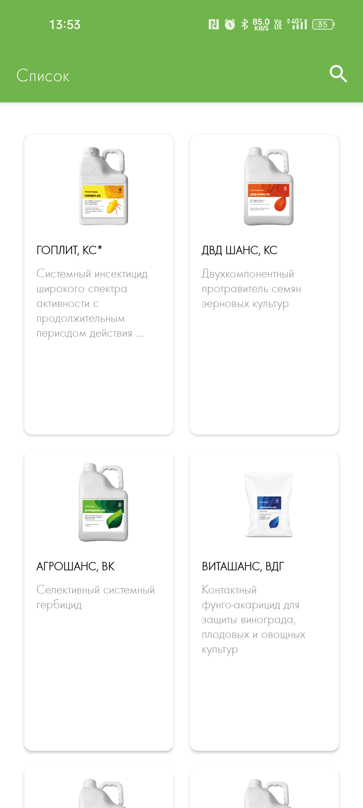
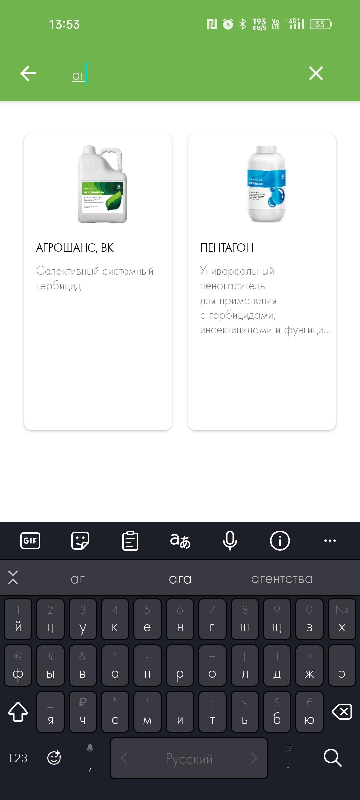

# BNet Test Application

## Описание

BNet Test — это тестовое Android-приложение, разработанное для демонстрации навыков работы с многопоточностью, архитектурой MVVM, библиотеками Hilt и Paging. 
Приложение взаимодействует с API для получения и отображения списка лекарств с поддержкой постраничной загрузки и функции поиска.

## Особенности

- Постраничная загрузка данных с использованием Paging 3
- Поиск по списку лекарств
- Внедрение зависимостей с использованием Hilt
- Атомарные типы и безопасный доступ к общим данным

## Установка

### Требования

- Android Studio (последняя версия)
- Android SDK

### Сборка проекта

1. Клонируйте репозиторий:
   ```bash
   git clone <URL_репозитория>
## Скриншоты

### Главный экран


### Поиск лекарств


### Экран с описанием

